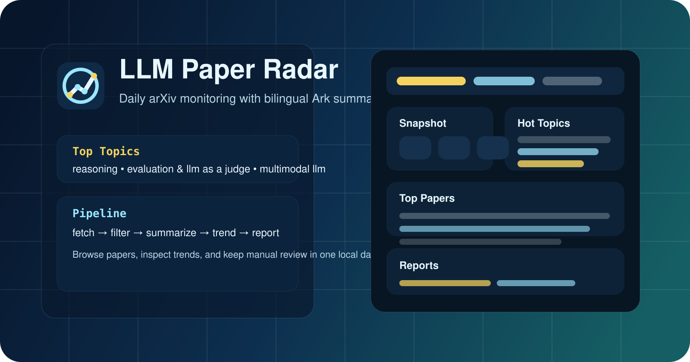
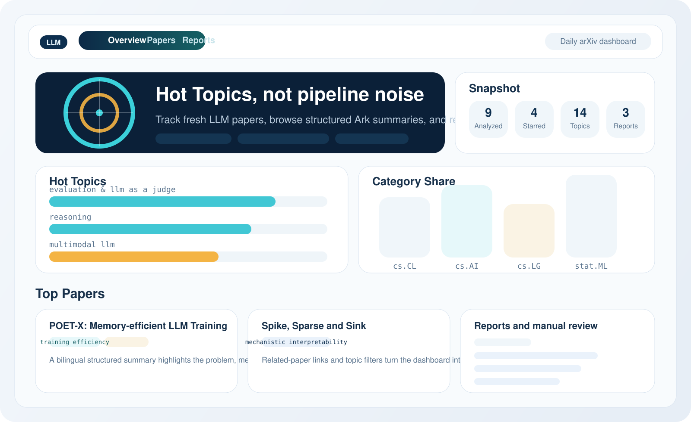

# LLM Paper Radar

[English](README.md) | [简体中文](README.zh-CN.md)

`LLM Paper Radar` 是 `arxiv-llm-watch` 这个 Python 包的公开项目名。它是一个面向 LLM 研究者的轻量级论文雷达：每天抓取新的 arXiv 论文，调用 Ark 生成双语结构化摘要，跟踪短期热点主题，并通过本地 dashboard 进行浏览和人工整理。

仓库里的关键信息入口：

- GitHub About 文案和 topics: [docs/github-launch-kit.md](docs/github-launch-kit.md)
- 架构说明: [docs/architecture.md](docs/architecture.md)
- 示例代码: [examples/README.md](examples/README.md)
- 发版检查清单: [RELEASE_CHECKLIST.md](RELEASE_CHECKLIST.md)
- 项目标志: [assets/brand/logo.svg](assets/brand/logo.svg)
- 贡献指南: [CONTRIBUTING.md](CONTRIBUTING.md)
- 行为准则: [CODE_OF_CONDUCT.md](CODE_OF_CONDUCT.md)
- 安全策略: [SECURITY.md](SECURITY.md)
- 变更记录: [CHANGELOG.md](CHANGELOG.md)

## 项目做什么

- 从可配置的 arXiv 分类中抓取最新论文
- 在调用模型前先做一层低成本关键词门禁
- 使用 Ark 生成双语结构化分析
- 将论文映射到一套受控的 LLM topic taxonomy
- 用滚动时间窗口计算热点主题
- 将状态保存到 SQLite，并生成 Markdown 日报
- 提供本地 dashboard 用于搜索、筛选、浏览和人工校正

当前实现只基于 arXiv 元数据工作：`title`、`abstract`、`categories`、时间和作者信息。暂时不解析 PDF 全文。

## 功能

### Pipeline

- 可配置的 arXiv 分类追踪
- 可按每轮限制分析篇数，控制 API 成本
- 输出 `summary`、`background`、`problem`、`method`、`findings`、`limitations` 的中英双语字段
- 支持 reasoning、agents、RAG、安全、效率、多模态、可解释性等方向的受控主题提取
- 生成包含热点、代表论文和跨论文对比的 Markdown 日报
- 支持最近 7 天、30 天或自定义时间窗口的周期汇总 / 对比报告
- 记录运行历史，便于基本观测

### Dashboard

- 独立的 `Overview`、`Papers`、`Reports` 三个视图
- 面向“每日阅读”的热点总览首页
- 支持关键词搜索、topic 筛选、排序、分页、时间窗口过滤
- 提供单篇论文详情页和相关论文推荐
- 支持人工操作：收藏、忽略、手动标 topic、备注、重新分析
- 提供报告归档和报告预览
- 内置分类占比和主题热度 SVG 图表

## 预览

仓库中已经包含 GitHub social preview 横幅和方形 logo，位于 `assets/brand/`。



GitHub social preview 可直接使用：

- 矢量横幅：`assets/brand/cover.svg`
- 生成版横幅：`assets/brand/cover-ark.jpg`

## 项目结构

```text
arxiv_llm_watch/
  cli.py
  config.py
  dashboard.py
  fetcher.py
  llm_client.py
  models.py
  pipeline.py
  reporter.py
  storage.py
  topics.py
tests/
examples/
docs/
```

## 安装

先创建虚拟环境并安装项目：

```bash
python3 -m venv .venv
source .venv/bin/activate
pip install -U pip
pip install -e .
```

如果你只是本地使用，不需要 editable install，也可以直接：

```bash
pip install -r requirements.txt
```

## 配置

复制 `.env.example` 为 `.env`，然后填入你的 Ark 配置。

### 环境变量

- `ARK_API_KEY`: Ark API Key
- `ARK_BASE_URL`: Ark API Base URL
- `ARK_MODEL`: Ark 模型名或 endpoint ID
- `ARXIV_CATEGORIES`: 逗号分隔的 arXiv 分类
- `ARXIV_KEYWORDS`: 可选，抓取阶段使用的关键词，和分类条件一起参与 arXiv 查询
- `ARXIV_MAX_RESULTS`: 日期过滤前，最多从 arXiv 拉取多少篇候选
- `LOOKBACK_DAYS`: 回看天数，只保留这个窗口内的新论文
- `TOPIC_RECENT_DAYS`: 热点计算中的近期窗口天数
- `TOPIC_BASELINE_DAYS`: 热点计算中的基线窗口天数
- `TOPIC_LIMIT`: 报告里展示多少个热点主题
- `REPORT_PAPER_LIMIT`: 报告里最多展示多少篇已分析论文，不影响抓取量和分析量
- `ANALYSIS_LIMIT_PER_RUN`: 每轮最多分析多少篇 `pending` 论文
- `DATA_DIR`: 本地状态输出目录
- `REPORTS_DIR`: 报告输出目录
- `DB_PATH`: SQLite 数据库路径
- `LLM_TEMPERATURE`: 结构化分析时的模型温度

## 使用方法

运行一轮 pipeline：

```bash
python3 -m arxiv_llm_watch.cli run
```

按需覆盖本轮参数：

```bash
python3 -m arxiv_llm_watch.cli run --lookback-days 4 --max-results 200 --query-keywords "reasoning,agent" --analysis-limit 6
```

生成周报或任意时间段的对比报告：

```bash
python3 -m arxiv_llm_watch.cli period-report --days 7
python3 -m arxiv_llm_watch.cli period-report --start-date 2026-03-01 --end-date 2026-03-07
```

Dashboard 的 `Reports` 页面也是同一套逻辑：

- `生成最近 7 天` 和 `生成最近 30 天` 是一键滚动汇总。
- `自定义时间段` 只在你明确要指定日期区间时使用。
- 每次周期报告都会自动与前一个等长时间段比较。

启动本地 dashboard：

```bash
python3 -m arxiv_llm_watch.cli dashboard
```

然后在浏览器打开 [http://127.0.0.1:8765](http://127.0.0.1:8765)。

如果你已经安装了这个包，也可以直接使用 console entry points：

```bash
arxiv-llm-watch run
arxiv-llm-watch dashboard
llm-paper-radar run
llm-paper-radar dashboard
```

## 输出产物

默认情况下，pipeline 会把本地运行产物写到被 `.gitignore` 忽略的目录里：

- SQLite 状态库：`data/arxiv_llm_watch.db`
- 带时间戳的日报：`reports/daily_YYYYMMDD_HHMMSS.md`

这些文件属于本地运行状态，不建议提交到仓库。

## 工作流程

1. 从指定 arXiv 分类抓取最近论文。
2. 用轻量关键词门禁先过滤明显无关的论文。
3. 将剩余论文送到 Ark，要求返回结构化 JSON 分析。
4. 提取模型 topic，并归一化到受控的 LLM tracked topics。
5. 基于近期窗口和基线窗口计算 topic momentum。
6. 生成 Markdown 报告，并刷新 dashboard 所需状态。
7. 按需生成一个周期汇总报告，用来对比当前窗口和前一个等长窗口。

## 调度

例如每天早上 `09:00` 自动跑一轮：

```cron
0 9 * * * cd /path/to/arxiv-llm-watch && /path/to/arxiv-llm-watch/.venv/bin/python -m arxiv_llm_watch.cli run
```

## 开源配套

- `.env`、本地数据库和生成的报告默认都被忽略
- `pyproject.toml` 里包含打包元信息和 CLI 入口
- GitHub Actions CI 会在 `push` 和 `pull_request` 上跑单测
- `.github/` 下已经带了 issue 模板、PR 模板和 Dependabot 配置
- 仓库已经包含 `LICENSE`、`CODE_OF_CONDUCT.md`、`CONTRIBUTING.md`、`SECURITY.md`、`CHANGELOG.md`

## 当前限制

- 目前只抓 arXiv 元数据，不解析 PDF 全文
- 热点主题在历史数据积累较少时会偏稀疏
- Ark 调用仍然是整条链路里最慢的一步
- dashboard 目前是本地进程级状态，不是多用户系统
- 关键词门禁是为了节省 API 成本，不是最终权威判断
