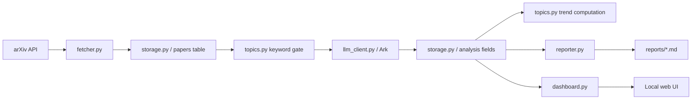

# Architecture

`LLM Paper Radar` is a local-first research monitoring tool. It pulls recent arXiv papers, filters and analyzes LLM-relevant items with Ark, stores structured state in SQLite, and exposes the results through Markdown reports and a small dashboard.

## Design goals

- keep the ingestion pipeline simple and cheap enough to run daily
- make intermediate state inspectable in SQLite and Markdown
- separate fetch, analysis, storage, reporting, and UI concerns
- support human review without requiring a larger backend stack

## High-level flow

## Main modules

### `config.py`

- loads `.env`
- normalizes runtime settings such as categories, keywords, and limits
- owns local data/report directory paths

### `fetcher.py`

- builds the arXiv query from configured categories and optional fetch keywords
- fetches recent metadata only
- de-duplicates papers by `entry_id`

### `pipeline.py`

- orchestrates one batch run
- writes run history
- saves fetched papers
- applies keyword gating
- sends pending papers to Ark for structured analysis
- computes topic momentum and writes a Markdown report

### `llm_client.py`

- wraps the Ark SDK
- asks the model for bilingual structured paper analysis
- returns normalized fields such as `summary`, `background`, `problem`, `method`, `findings`, and `limitations`

### `topics.py`

- applies low-cost local keyword gating before model calls
- maps raw model topics into a controlled LLM topic taxonomy
- computes rolling hot-topic momentum over recent and baseline windows

### `storage.py`

- owns SQLite schema and queries
- stores papers, analysis results, review actions, and run history
- provides search, filtering, and related-paper retrieval for the dashboard

### `reporter.py`

- renders timestamped Markdown reports
- summarizes hot topics, representative papers, visual snapshots, and cross-paper comparisons
- generates period comparison reports for weekly or custom windows

### `dashboard.py`

- serves a local HTTP dashboard
- renders overview, paper explorer, and report archive views
- exposes JSON endpoints for batch runs, search, report loading, and paper actions

## Data model

### `papers`

Stores:

- arXiv metadata: title, abstract, categories, authors, dates, PDF URL
- analysis status: `pending`, `filtered`, `rejected`, `analyzed`, `error`
- Ark output fields
- manual review fields: starred, ignored, manual topics, analyst note

### `run_history`

Stores:

- per-run start and finish time
- runtime overrides
- fetched / queued / analyzed counts
- filtered / rejected / error counts
- generated report path

## Runtime outputs

- SQLite database: `data/arxiv_llm_watch.db`
- timestamped reports: `reports/daily_YYYYMMDD_HHMMSS.md`
- dashboard: `http://127.0.0.1:8765`

## Why SQLite + local HTTP

This project deliberately avoids a larger service stack.

- SQLite is enough for a personal or small-team research monitor
- Markdown reports are easy to diff, archive, and share
- the dashboard can run without Docker, Redis, or a separate API server

## Extension points

Good next extensions:

- add richer ranking signals such as citation or external trend sources
- replace metadata-only analysis with PDF parsing
- export reports to email, Feishu, Slack, or Notion
- add a stronger task queue if concurrency or throughput becomes a bottleneck

## Current constraints

- arXiv fetch is metadata-only
- topic momentum is based on short rolling windows, so early history is sparse
- Ark calls are still the slowest step in the loop
- dashboard state is local-process scoped, not multi-user
